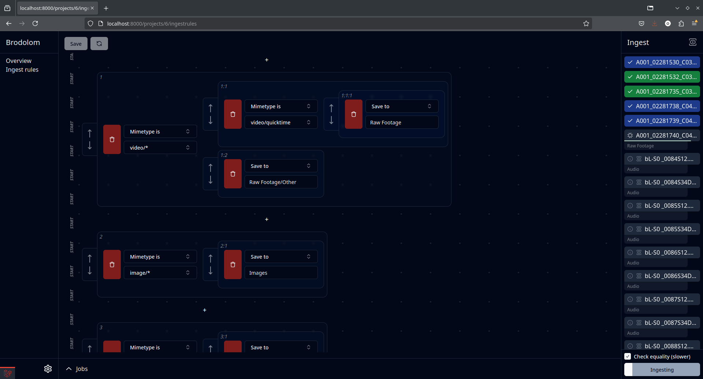

## Ingest Station
**Ingest Station** is a Laravel based web app used for ingesting and processign a large amount of files (primarily raw video footage) directly onto a NAS

### Features (WIP)
 - Add storage/ingest volumes
 - Index storage/ingest volumes (used internally while ingesting)
 - Create project with fixed (for now) directory structure
 - Create ingest rules for each project with ingest rule operations
 - Ingest files from an ingest volume and organize them into directories dictated by ingest rules
 - Realtime ingest progress and web app state updates using websockets
 - Check for overwrites in target project (optionally overwrite if files aren't equal)
 - Live update of ingest progress and file copying progress on web UI
 
### Ingest Rule Operations
#### Mimetype is
`"Mimetype is"` checks if a file has a specific (e.g. `"video/mp4"`) or generic wildcard (e.g. `"image/*"`) mimetype

#### Filename contains
`"Filename contains"` checks if the file's full name contains the specified string (e.g. check if file `"A002_05241705_C012.braw"` contains `"A002"`) .

#### Contains EXIF tag
`"Contains EXIF tag"` checks if a file contains a specific raw EXIF tag (e.g. `"Composite:LensId"`, extracted using exiftool).

#### EXIF tag is
`"EXIF tag is"` checks if a file contains a specific raw EXIF tag and if it is equal to the specified value (e.g. tag: `"Keys:CameraType"`, criteria: `"Blackmagic Pocket Cinema Camera 6K G2"`).

#### Save to
When reached, saves to the specified directory (e.g. `"Raw Footage/Quicktime"`).

### Screenshots

